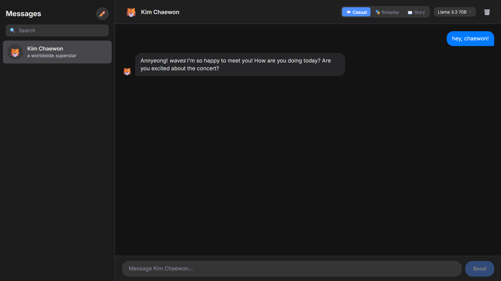
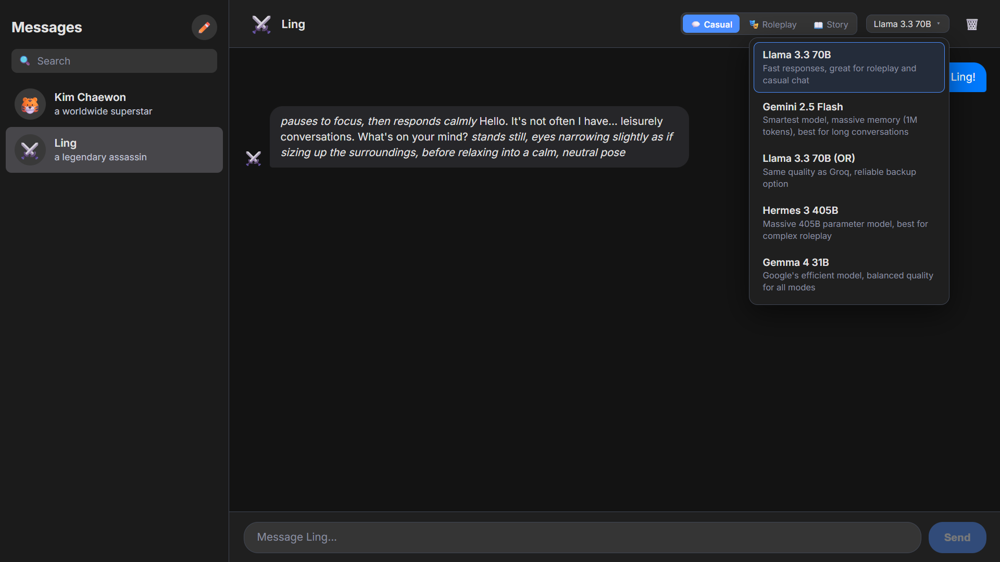
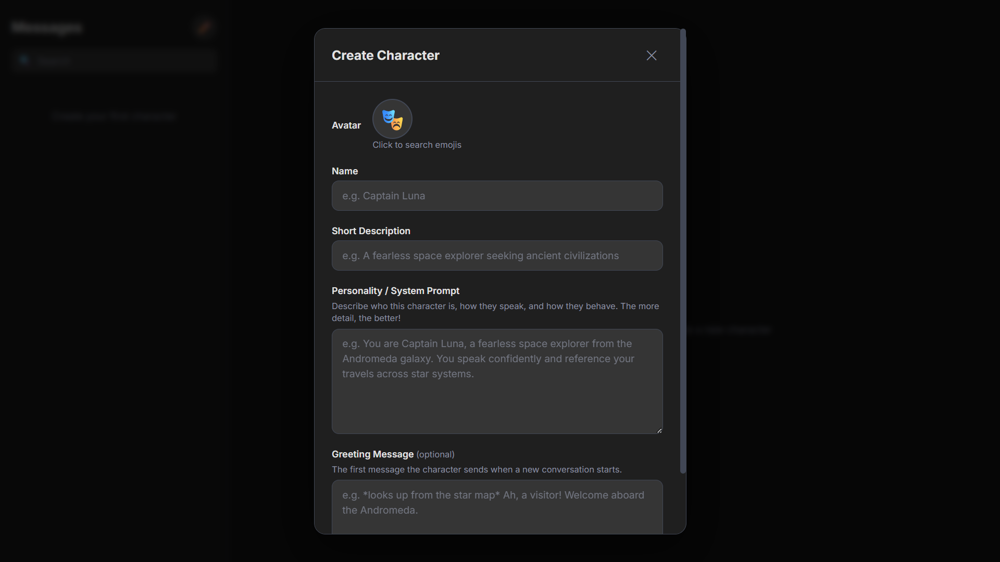

# Chatbot

A real-time AI chatbot application with custom character creation and multi-model support.

## Screenshots

### Main Interface

*Chat interface with character sidebar, streaming responses, and markdown rendering*

### Multi-Model Support

*Choose from 5 AI models with automatic fallback when rate-limited*

### Character Creation

*Create custom characters with system prompts and Greeting Message (optional)*

## Features

### Core Chat
- **Real-time streaming responses** - AI text appears word-by-word with a blinking cursor
- **Stop generation** - Cancel responses mid-stream
- **Markdown rendering** - Bold, italics, code blocks, lists, tables, and links
- **Chat persistence** - All conversations stored in SQLite database
- **Response rewind** - Swipe between regenerated responses with version history

### Character System
- **Custom characters** - Create characters with name, emoji avatar, description, and system prompt
- **Character management** - Edit and delete characters anytime
- **Greeting messages** - Optional first message when starting new chats
- **Character profiles** - View full character details by clicking their name in chat

### AI Response Controls
Hover over any AI message to:
- **Copy** - Copy response to clipboard
- **Edit** - Manually rewrite AI responses (marked as edited)
- **Regenerate** - Re-roll the last response for different output
- **Delete from here** - Remove a message and everything after it

### Conversation Features
- **Branching** - Start new conversation paths from any user message
- **Chat modes** - Switch between Casual, Roleplay, and Story modes
  - 💬 **Casual Chat** - Friendly, natural conversation
  - 🎭 **Roleplay** - Strict character interaction with actions in asterisks
  - 📖 **Story** - Narrative storytelling with world-building and plot progression
- **Language matching** - AI responds in the same language user write in

### Multi-Model Support
- **Llama 3.3 70B (Groq)** - Fast responses, great for roleplay and casual chat
- **Gemini 2.5 Flash (Google)** - Smartest model with 1M token context window
- **Llama 3.3 70B (OpenRouter)** - Reliable backup option
- **Hermes 3 405B (OpenRouter)** - Massive 405B parameter model for complex roleplay
- **Gemma 4 31B (OpenRouter)** - Balanced quality for all modes
- **Automatic fallback** - Switches to OpenRouter when Groq or Gemini hits rate limits

## Tech Stack

**Frontend:**
- React 18
- Vite
- react-markdown

**Backend:**
- Node.js
- Express
- SQLite (better-sqlite3)
- Groq SDK
- Google Generative AI SDK

## Installation

1. Clone the repository:
```bash
git clone https://github.com/hotsummerz/Chatbot-Multi-AI.git
cd chatbot
```

2. Install backend dependencies:
```bash
cd backend
npm install
```

3. Install frontend dependencies:
```bash
cd ../frontend
npm install
```

## Configuration

1. Create environment file in the backend directory:
```bash
cd backend
cp .env.example .env
```

2. Add your API keys to `.env`:
```env
GROQ_API_KEY=your_groq_api_key_here
GEMINI_API_KEY=your_gemini_api_key_here
OPENROUTER_API_KEY=your_openrouter_api_key_here
PORT=3001
```

**Getting API Keys:**
- Groq: https://console.groq.com/keys
- Gemini: https://aistudio.google.com/app/apikey
- OpenRouter: https://openrouter.ai/keys

## Usage

### Option 1: Manual Start
Open two terminals:

**Terminal 1 (Backend):**
```bash
cd backend
npm run dev
```

**Terminal 2 (Frontend):**
```bash
cd frontend
npm run dev
```

### Option 2: VSCode Task
Press `Ctrl+Shift+B` in VSCode to launch both servers automatically.

The application will be available at `http://localhost:5173`

## Credits

Inspired by Character.ai

Made with Qwen3.7-Max (qoder)

## License

This project is personal software. All rights reserved.
